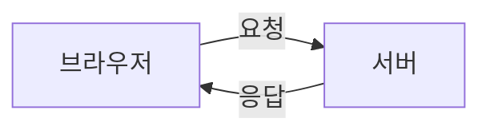
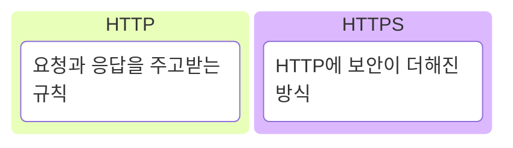
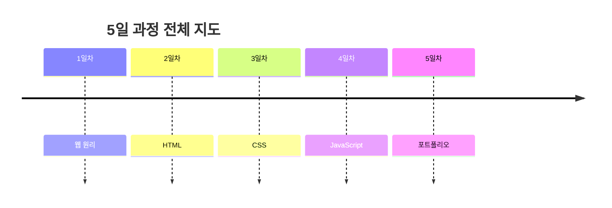
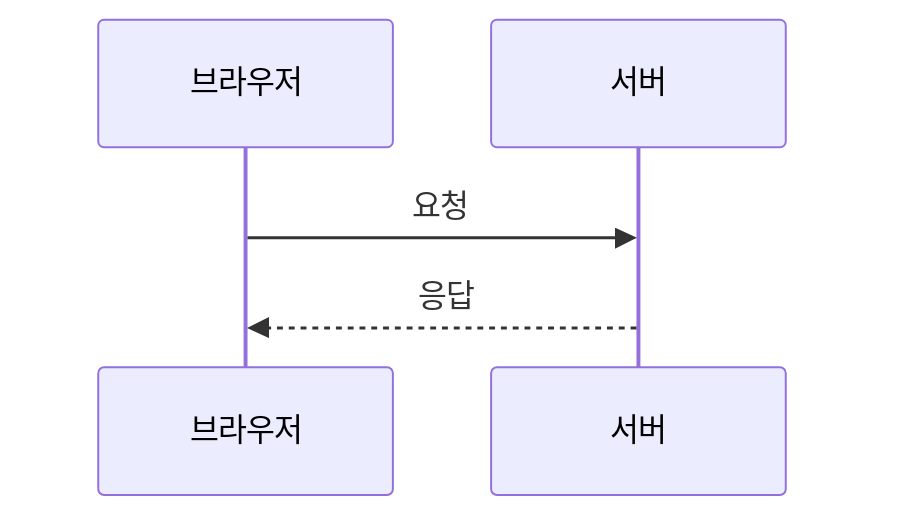
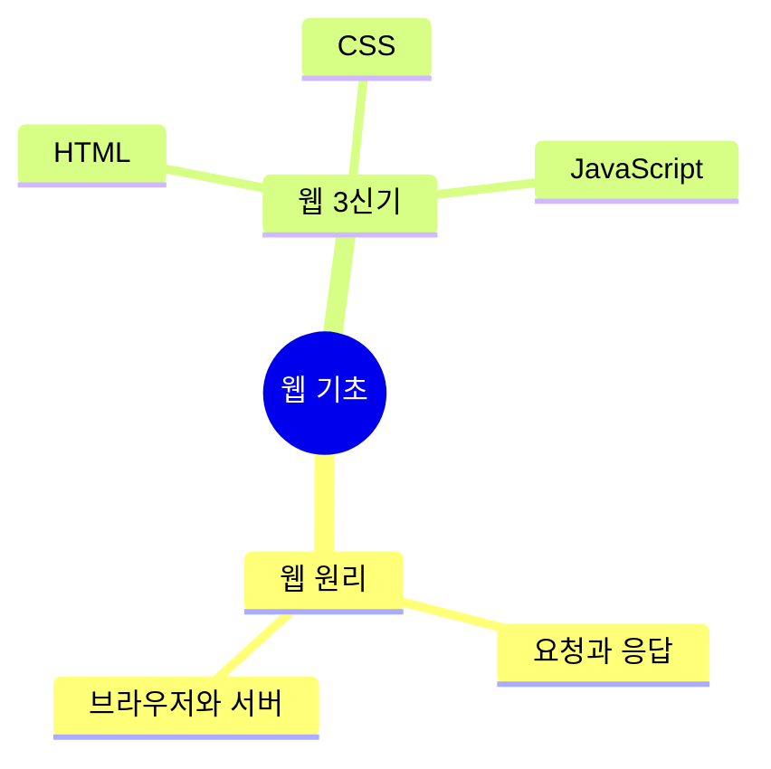
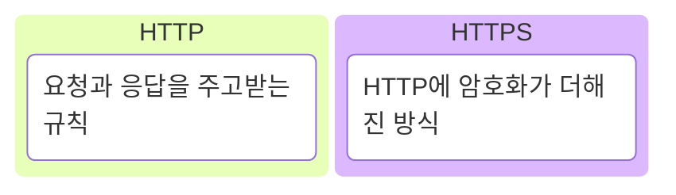
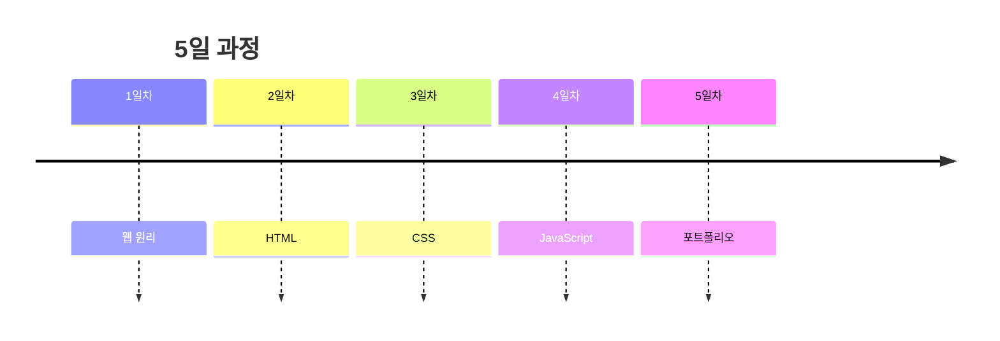
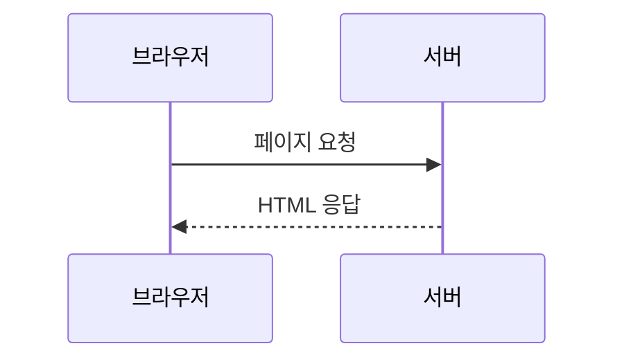

# Markdown Writing Guide

This guide explains how to write input Markdown for `md-slide`.

The goal is not to write final visual design in Markdown. The Markdown should be
a slide blueprint: one clear message per slide, only the necessary visible
content on screen, and detailed explanation in speaker notes.

## Core Principles

- Write the source as Markdown.
- Treat the source as a slide blueprint, not as the final design file.
- Do not put every note directly on the slide.
- Keep one core message per slide.
- Put only the visible essentials in `화면 내용`.
- Put detailed explanation, analogies, and presenter scripts in `발표 메모`.

## Slide Structure

Each slide should use this structure:

~~~markdown
# 슬라이드 00. 슬라이드 이름

## 화면 제목
청중이 바로 이해할 수 있는 짧은 제목

## 화면 내용
슬라이드에 실제로 보일 핵심 문장 또는 항목

## 화면 구성
필요한 경우 Mermaid 코드블럭 사용

## 발표 메모
강사가 말로 설명할 내용
~~~

### Section Rules

- `화면 제목` should be short and clear.
- `화면 내용` should contain visible slide content, not a full script.
- `화면 구성` should be used only when a diagram or visual structure is needed.
- `발표 메모` should contain detailed explanation, examples, analogies, and
  presenter flow.

## Mermaid Usage

Use Mermaid only when a visual structure helps the audience understand the
slide.

The generator allows these Mermaid types:

```text
flowchart
kanban
timeline
sequenceDiagram
mindmap
```

Avoid these Mermaid types because they are more likely to break or become hard
to read after PPT/PDF conversion:

```text
architecture-beta
block-beta
quadrantChart
journey
```

## Code Block Usage

Use fenced code blocks in `화면 내용` when the slide needs to show small HTML,
CSS, or JavaScript examples.

The generator renders non-Mermaid fenced code blocks as code blocks in PPTX:

- dark code background
- monospace code text
- language label, when a language is provided
- preserved line breaks and indentation

Good uses:

- Short HTML tag examples
- Small CSS rules
- Small JavaScript snippets
- Prompt or template text that should look distinct from normal body copy

Keep code examples short enough to read at slide size. If the code is long,
split it across slides or move details to `발표 메모`.

Example:

```html
<h1>광주 마을 신문</h1>
<p>오늘 웹 기초 수업이 시작되었습니다.</p>

```

Supported language labels include:

```text
html
css
js
javascript
```

Code blocks without a language label are also rendered as code blocks, but a
language label is recommended when the code is HTML, CSS, or JavaScript.

## Choosing A Mermaid Type

### `flowchart`

Use `flowchart` for order, structure, hierarchy, and conceptual flow.

Good uses:

- Web request and response
- DNS to IP to server
- Services under the internet
- Summary structures
- Top-down concept hierarchy

Direction rules:

```text
flowchart LR  : left-to-right flow
flowchart TB  : top-to-bottom hierarchy
```

Example:



### `kanban`

Use `kanban` for comparison and classification.

Good uses:

- Internet vs web
- HTTP vs HTTPS
- Frontend vs backend
- Static website vs dynamic website
- HTML / CSS / JavaScript
- Web / not web

Example:



### `timeline`

Use `timeline` when the content has chronological order.

Good uses:

- Day 1 to Day 5 curriculum
- Class progress
- Project stages

Example:



### `sequenceDiagram`

Use `sequenceDiagram` when multiple actors exchange requests and responses.

Good uses:

- Browser to server
- Browser to DNS to server
- Frontend to backend to database
- User to screen to server

Example:



Recommendations:

- Keep participants to 4 or fewer when possible.
- Avoid self-messages when possible.
- Keep message labels short.
- These are readability guidelines, not hard bans. If the concept needs it, a
  diagram may use 5 participants or a self-message.

### `mindmap`

Use `mindmap` for concept groups and overview maps.

Good uses:

- Course overview
- Concepts under one topic
- Learning scope maps
- Simple mental models

Example:



Recommendations:

- Keep depth to 2 or 3 levels when possible.
- Keep labels short.
- Avoid using mindmaps for strict order or cause-and-effect.
- Use `flowchart TB` instead when hierarchy must be precise and easy to scan.

## Stable Mermaid Rules

For PPT/PDF conversion, Mermaid should stay simple.

- Keep one diagram to roughly 8 nodes or fewer when possible.
- Keep node labels short.
- Move long explanations to `발표 메모`.
- Use `<br/>` for intentional line breaks.
- Prefer a simple diagram over a clever diagram.
- Use `kanban` for comparison instead of forcing comparison into `flowchart`.
- Use `mindmap` only for compact concept maps; use `flowchart TB` when the
  hierarchy needs to be more controlled.
- Use `flowchart` or `sequenceDiagram` for system structure instead of
  `architecture-beta`.
- Use `kanban` for 2D comparison instead of `quadrantChart`.
- Break these guidelines only when clarity requires it, and still keep the
  diagram readable at slide size.

## Full Slide Examples

These examples show complete slides, not just Mermaid snippets.

### Content-Only Slide

Use this when text alone is enough.

~~~markdown
# 슬라이드 01. 오늘의 목표

## 화면 제목
웹이 어떻게 움직이는지 큰 흐름을 이해한다

## 화면 내용
- 브라우저와 서버의 역할
- 요청과 응답
- HTML, CSS, JavaScript의 위치

## 발표 메모
오늘은 코드를 많이 외우기보다 웹이 움직이는 기본 흐름을 잡는 것이 목표입니다.
~~~

### Flowchart Slide

Use this when showing a process or hierarchy.

~~~markdown
# 슬라이드 02. 웹 요청 흐름

## 화면 제목
브라우저는 서버에 요청하고 응답을 받는다

## 화면 내용
웹의 기본은 요청과 응답입니다.

## 화면 구성


## 발표 메모
브라우저가 먼저 요청을 보내고, 서버가 그 요청에 맞는 결과를 돌려줍니다.
~~~

### Kanban Slide

Use this when comparing categories.

~~~markdown
# 슬라이드 03. HTTP와 HTTPS

## 화면 제목
HTTPS는 HTTP에 보안이 더해진 방식이다

## 화면 내용
두 용어는 완전히 다른 것이 아니라 보안 여부가 핵심 차이입니다.

## 화면 구성


## 발표 메모
HTTP는 통신 규칙이고, HTTPS는 그 통신을 더 안전하게 만든 방식이라고 설명합니다.
~~~

### Timeline Slide

Use this when the content has ordered stages.

~~~markdown
# 슬라이드 04. 5일 과정

## 화면 제목
웹 원리부터 포트폴리오까지 순서대로 만든다

## 화면 내용
각 날짜는 다음 단계로 넘어가기 위한 준비 과정입니다.

## 화면 구성


## 발표 메모
각 날짜의 결과물이 다음 날짜의 재료가 된다는 식으로 설명합니다.
~~~

### Sequence Slide

Use this when actors exchange requests and responses.

~~~markdown
# 슬라이드 05. 페이지 요청

## 화면 제목
브라우저가 요청하면 서버가 HTML을 응답한다

## 화면 내용
화면이 보이기 전에는 요청과 응답이 먼저 일어납니다.

## 화면 구성


## 발표 메모
sequenceDiagram은 주체 사이의 대화를 보여주는 데 사용합니다.
~~~

### Mindmap Slide

Use this when showing a compact concept map.

~~~markdown
# 슬라이드 06. 웹 기초 지도

## 화면 제목
웹 기초는 원리와 도구로 나누어 볼 수 있다

## 화면 내용
전체 범위를 먼저 보고, 세부 개념은 이후 슬라이드에서 다룹니다.

## 화면 구성


## 발표 메모
mindmap은 전체 범위를 빠르게 보여줄 때만 사용합니다. 순서가 중요하면 timeline이나 flowchart를 씁니다.
~~~

## Writing Checklist

- Does the slide have one clear message?
- Is the visible text short enough to read quickly?
- Did long explanation move to `발표 메모`?
- Is Mermaid used only when it improves understanding?
- Did you choose the Mermaid type based on the content, not habit?
- Are diagram labels short enough to fit inside nodes or arrows?
- Is the mindmap shallow enough to read at slide size?

## Recommended Workflow

1. Write the slide blueprint in Markdown.
2. Decide the visual role of each slide.
3. Add Mermaid only when the slide needs a diagram.
4. Choose one of `flowchart`, `kanban`, `timeline`, `sequenceDiagram`, or `mindmap`.
5. Keep the slide visible content short.
6. Put presenter explanation in `발표 메모`.
7. Run validation before building the deck.

```bash
node src/cli.js validate input.md
node src/cli.js build input.md --out deck.pptx
```
