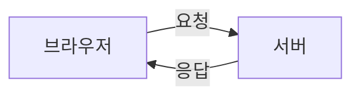
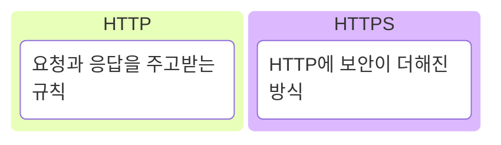
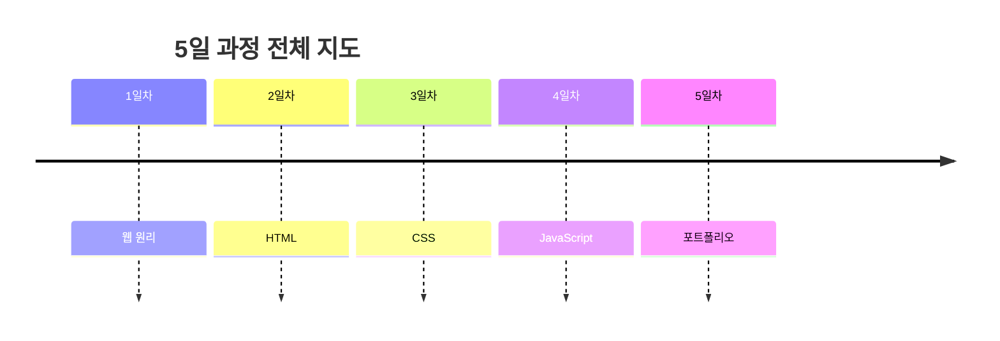
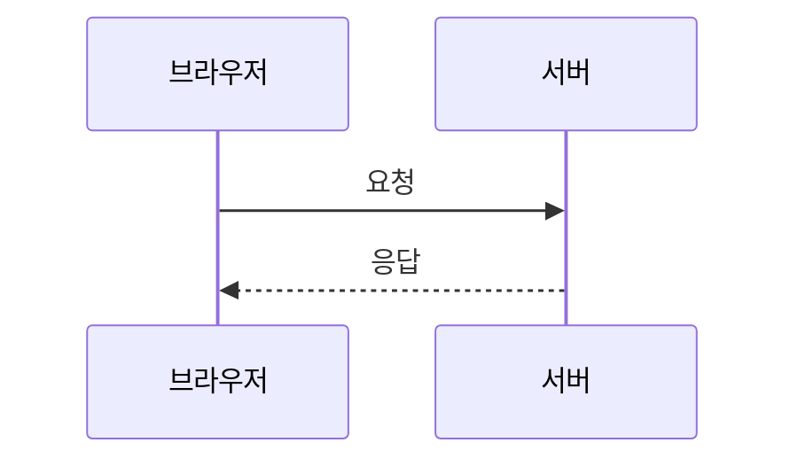

# Markdown Writing Guide

This guide explains how to write input Markdown for `md-slide`.

The goal is not to write final visual design in Markdown. The Markdown should be
a slide blueprint: one clear message per slide, only the necessary visible
content on screen, and detailed explanation in speaker notes.

## Core Principles

- Write the source as Markdown.
- Treat the source as a slide blueprint, not as the final design file.
- Do not put every note directly on the slide.
- Keep one core message per slide.
- Put only the visible essentials in `화면 내용`.
- Put detailed explanation, analogies, and presenter scripts in `발표 메모`.

## Slide Structure

Each slide should use this structure:

~~~markdown
# 슬라이드 00. 슬라이드 이름

## 화면 제목
청중이 바로 이해할 수 있는 짧은 제목

## 화면 내용
슬라이드에 실제로 보일 핵심 문장 또는 항목

## 화면 구성
필요한 경우 Mermaid 코드블럭 사용

## 발표 메모
강사가 말로 설명할 내용
~~~

### Section Rules

- `화면 제목` should be short and clear.
- `화면 내용` should contain visible slide content, not a full script.
- `화면 구성` should be used only when a diagram or visual structure is needed.
- `발표 메모` should contain detailed explanation, examples, analogies, and
  presenter flow.

## Mermaid Usage

Use Mermaid only when a visual structure helps the audience understand the
slide.

The generator allows these Mermaid types:

```text
flowchart
kanban
timeline
sequenceDiagram
```

Avoid these Mermaid types because they are more likely to break or become hard
to read after PPT/PDF conversion:

```text
mindmap
architecture-beta
block-beta
quadrantChart
journey
```

## Choosing A Mermaid Type

### `flowchart`

Use `flowchart` for order, structure, hierarchy, and conceptual flow.

Good uses:

- Web request and response
- DNS to IP to server
- Services under the internet
- Summary structures
- Top-down concept hierarchy

Direction rules:

```text
flowchart LR  : left-to-right flow
flowchart TB  : top-to-bottom hierarchy
```

Example:



### `kanban`

Use `kanban` for comparison and classification.

Good uses:

- Internet vs web
- HTTP vs HTTPS
- Frontend vs backend
- Static website vs dynamic website
- HTML / CSS / JavaScript
- Web / not web

Example:



### `timeline`

Use `timeline` when the content has chronological order.

Good uses:

- Day 1 to Day 5 curriculum
- Class progress
- Project stages

Example:



### `sequenceDiagram`

Use `sequenceDiagram` when multiple actors exchange requests and responses.

Good uses:

- Browser to server
- Browser to DNS to server
- Frontend to backend to database
- User to screen to server

Example:



Recommendations:

- Keep participants to 4 or fewer when possible.
- Avoid self-messages when possible.
- Keep message labels short.
- These are readability guidelines, not hard bans. If the concept needs it, a
  diagram may use 5 participants or a self-message.

## Stable Mermaid Rules

For PPT/PDF conversion, Mermaid should stay simple.

- Keep one diagram to roughly 8 nodes or fewer when possible.
- Keep node labels short.
- Move long explanations to `발표 메모`.
- Use `<br/>` for intentional line breaks.
- Prefer a simple diagram over a clever diagram.
- Use `kanban` for comparison instead of forcing comparison into `flowchart`.
- Use `flowchart TB` for concept groups instead of `mindmap`.
- Use `flowchart` or `sequenceDiagram` for system structure instead of
  `architecture-beta`.
- Use `kanban` for 2D comparison instead of `quadrantChart`.
- Break these guidelines only when clarity requires it, and still keep the
  diagram readable at slide size.

## Recommended Workflow

1. Write the slide blueprint in Markdown.
2. Decide the visual role of each slide.
3. Add Mermaid only when the slide needs a diagram.
4. Choose one of `flowchart`, `kanban`, `timeline`, or `sequenceDiagram`.
5. Keep the slide visible content short.
6. Put presenter explanation in `발표 메모`.
7. Run validation before building the deck.

```bash
node src/cli.js validate input.md
node src/cli.js build input.md --out deck.pptx
```
