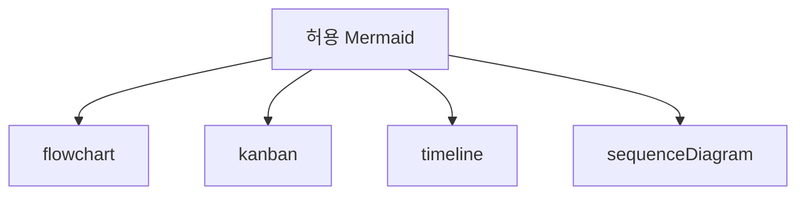

# 슬라이드 00. 발표 자료 생성기

## 화면 제목
Markdown을 16:9 발표 자료로 변환

## 화면 내용
- Notion/Markdown 문서를 슬라이드 설계도로 사용
- 화면 내용과 발표 메모를 분리
- Mermaid는 안정적인 네 가지 타입만 허용

## 발표 메모
이 슬라이드는 전체 프로그램의 목적을 설명합니다.

---

# 슬라이드 01. 생성 흐름

## 화면 제목
설계도를 읽고 발표 화면으로 다시 배치한다

## 화면 내용
입력 Markdown을 그대로 밀어 넣지 않고, 슬라이드 구조로 파싱한 뒤 16:9 화면에 맞게 재배치합니다.

## 화면 구성

## 발표 메모
핵심은 변환이 아니라 재배치입니다. 화면에는 핵심만 남기고 상세 설명은 발표 메모로 분리합니다.

---

# 슬라이드 02. 허용 Mermaid 타입

## 화면 제목
안 깨지는 네 가지 Mermaid만 사용한다

## 화면 내용
복잡한 다이어그램보다 안정적으로 렌더링되는 표현을 우선합니다.

## 화면 구성

## 발표 메모
PPT/PDF 변환 안정성을 위해 타입을 제한합니다.
