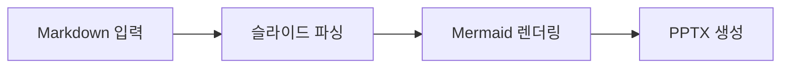
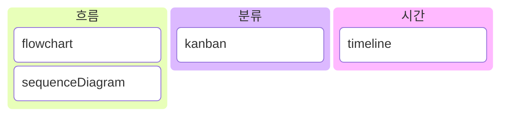
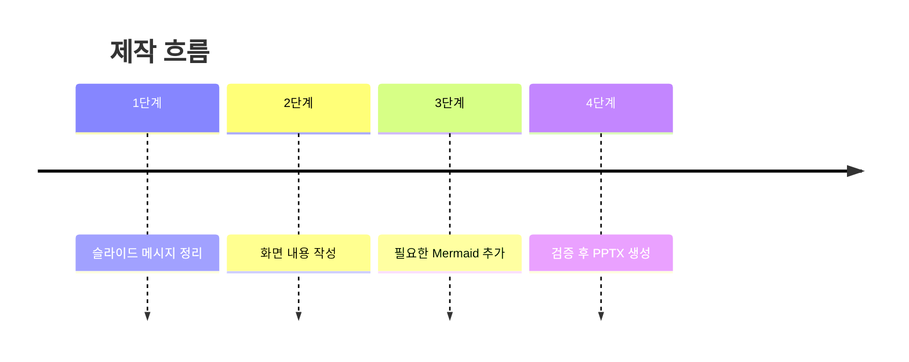
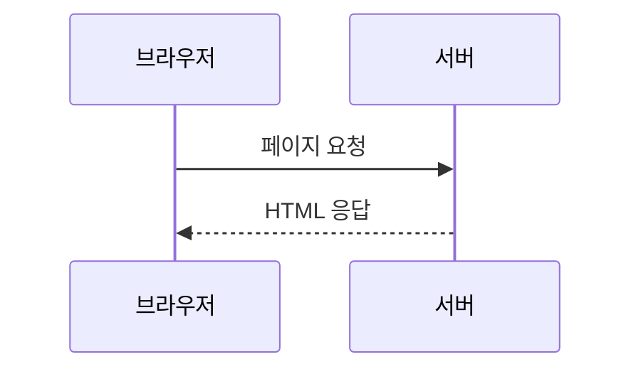

# 슬라이드 00. 발표 자료 생성기

## 화면 제목
Markdown을 16:9 발표 자료로 변환

## 화면 내용
- Markdown 문서를 슬라이드 설계도로 사용
- 화면 내용과 발표 메모를 분리
- Mermaid는 안정적인 네 가지 타입만 허용

## 발표 메모
이 슬라이드는 전체 프로그램의 목적을 설명합니다.

---

# 슬라이드 01. 생성 흐름

## 화면 제목
설계도를 읽고 발표 화면으로 다시 배치한다

## 화면 내용
입력 Markdown을 그대로 밀어 넣지 않고, 슬라이드 구조로 파싱한 뒤 16:9 화면에 맞게 재배치합니다.

## 화면 구성

## 발표 메모
핵심은 변환이 아니라 재배치입니다. 화면에는 핵심만 남기고 상세 설명은 발표 메모로 분리합니다.

---

# 슬라이드 02. Mermaid 타입 선택

## 화면 제목
내용 성격에 맞는 Mermaid를 고른다

## 화면 내용
비교, 시간 순서, 요청과 응답은 각각 다른 표현을 쓰는 편이 읽기 쉽습니다.

## 화면 구성

## 발표 메모
Mermaid 타입은 표현하고 싶은 정보의 성격에 맞춰 선택합니다. 억지로 모든 것을 flowchart로 만들지 않습니다.

---

# 슬라이드 03. 제작 순서

## 화면 제목
먼저 구조를 정하고 나중에 PPTX로 만든다

## 화면 내용
슬라이드 작성은 원고 작성이 아니라 화면 설계에 가깝습니다.

## 화면 구성

## 발표 메모
좋은 입력 Markdown은 생성기가 그대로 밀어 넣는 문서가 아니라, 발표 화면을 만들기 위한 설계도입니다.

---

# 슬라이드 04. 요청과 응답

## 화면 제목
주체가 말을 주고받을 때는 sequenceDiagram을 쓴다

## 화면 내용
누가 누구에게 요청하고, 누가 응답하는지 보여줄 때 가장 적합합니다.

## 화면 구성

## 발표 메모
sequenceDiagram은 브라우저, 서버, 데이터베이스처럼 주체가 명확할 때 사용합니다. 메시지는 짧게 유지합니다.
